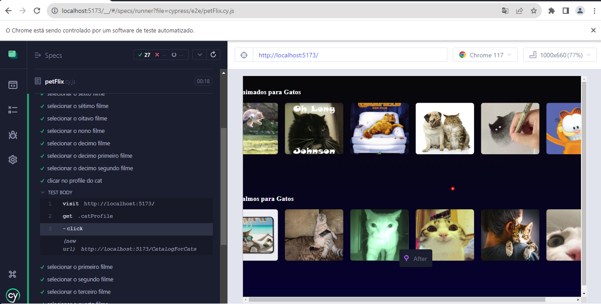

<h1 align="center" href="#clipboard-about"> Petflix </h1>

## :clipboard: About:
Hi, I'm [Alexsander Marchi Zunino](https://www.linkedin.com/in/alexsander-marchi-zunino-226332170/) and here I show a project that is similar to a streaming website like Netflix or Disney+. Here is the goals of the project:

- API development that return an array of valid videos;
- Front-end web interface developed in React;
- An high fidelity prototype Cypress tests apresentation;
- Apresentation of the project to the class;

Scan here to enter the site: [pet-flix-henna.vercel.app/](https://pet-flix-henna.vercel.app/)

  
   

We used Firebase Storage to save the videos. In the API, that was developed in the MVC model, it's created an object array that the front
take through a request. This project was developed with my classmate [Vitor Hugo](https://github.com/vitorhugodsouzax):

  
   

And for test the functions, we used Cypress:

  
   

  
